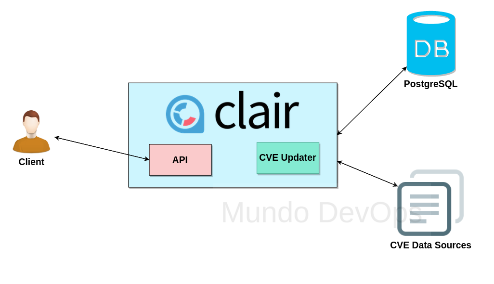

# Clair en K8s



- Files
    - **config.yaml** ( Archivo de configuraciones de Clair, se puede aplicar como secreto )
    - **clair-k8s.yaml** ( Manifiestos de Clair con el secret )

## Procedimiento
He dejado dos formas de despliegue, un all in one para aplicar solo un archivo o de forma separada. 

- All in one
```bash
kubectl apply -f ./k8s/all-in-one-clair.yaml
```

- Primero el secret y luego los manifiestos
```bash
kubectl create secret generic clairsecret --from-file=./k8s/config.yaml
kubectl apply -f ./k8s/clair-k8s.yaml
```

## Port Forward
kubectl port-forward pod/$CLAIR_POD 6060:6060

## Analisis con cliente Klar
https://github.com/optiopay/klar

```bash
SCAN=$( CLAIR_ADDR=http://localhost:6060 JSON_OUTPUT=true klar ubuntu:14.04 ) &&\ 
echo $SCAN | jq -r .Vulnerabilities 
```

### Ref:
- https://coreos.com/clair/docs/latest/
